<h1>How to make a Quiz Game with python</h1>


<h2>Description</h2>
With this lab we gain a better understanding of the Python language through use of lists, objects, looping, and functions to create a quiz game.
This program will provide the user with a series of questions and give you some answers for you to answer. The program will give you a feedback whether you provided the correct answer or not then give an explaination of the correct answer. While the program is running it will keep track of your score. when the quiz is finish the program will print your results. <br/>
<br/>
In this example we are making a sneakerhead quiz game but feel free to take the information shown and modify it to a topic that quizes you on a subject of your liking.  <br />
<br/>
Lets walk through it!<br/>
<br/>
Heads up:
- Coding indentation follows PEP8 style guide for python through out the project.<br/>
- \n : tells the program to print an empty line.
- f : Used infront of a string allowing variable to be used. 

<h2>Languages and Utilities Used</h2>

- <b>Python3</b>
- <b>Terminal on Kali Linux</b> 
- <b>Nano Text Editior</b> 7.2

<h2>Environments Used </h2>

- <b>Kali Linux</b> (2024.1-amd64)

<h2>Writing the code:</h2>

<p>
First create a list: <br/>
- This list contains objects with different properties.<br/>
  - Here we have the prompt which is the question.<br/>
  - The option which are the answers to choose from.<br/>
  - The answer which is the correct answer define by the letter.<br/>
  - The explaination which will explain the correct answer if user made the wrong choice.<br/>
<br/>
  Quick tip : Write out the questions, answers, and explaination on a seperate text document. This allowed us to paste in the information and focus more on the formatting of the objects in the list.<br/>
<br />
<br />

Loop object:  <br/>
By putting the object in the curly brackets this will allow us to display each question one by one.<br/>
<br />
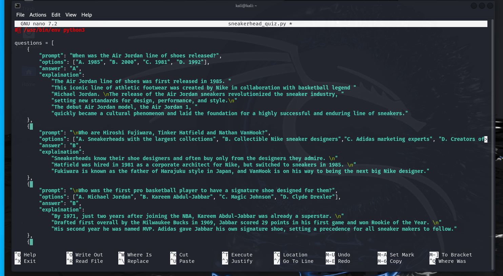
<br />
<br />
Define the function:  <br/>
<br />
Once the list of questions are in place, define a function. In the example below the function is run_quiz and will take the parameters of questions which will run at the end. <br/>
- Next, initialize a score variable at zero to keep track of the user score <br />
<br />
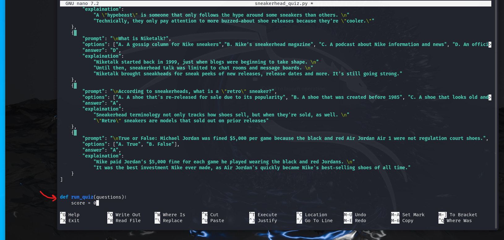
<br />
- Create a for loop for these questions. This loops though all of the individual objects (prompt, option, answer, and explanation) where the question variable refers to each object in the array respectively.<br/>
  - Inside the loop, print the question in the terminal. Print out the question by accessing the prompt attribute of the questions object.<br/>
    Coding indentation follows PEP8 style guide for python through out the project.<br/>
    <br />
    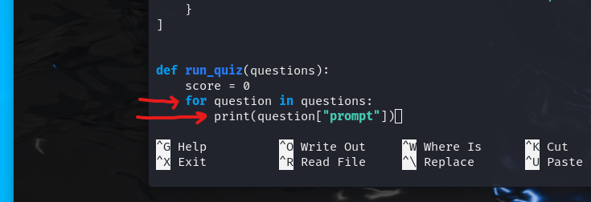
    <br />
  - Create another for loop inside our question loop. The variable is option and we are accessing the options attribure of the questions objects.  <br />
    This will print out the answer choices line by line.  <br />
    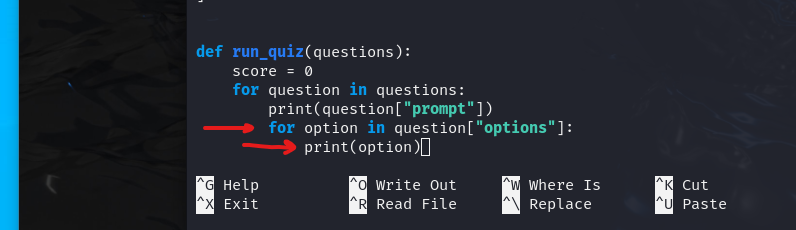
    <br />
  - Lets check on our code to make sure nothing is broken. <br />
    Use the run_quiz(questions) command outside and below of defined run_quiz funtion.<br />
    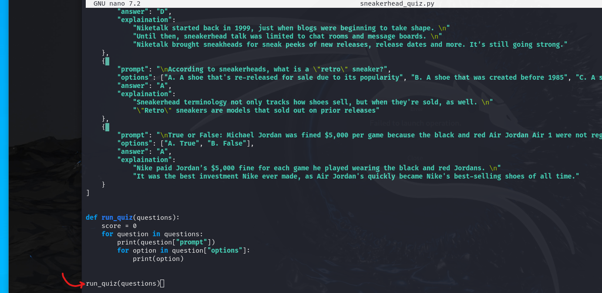<br />
    <br />
    It shoukd look like this if everything is up and running. <br />
    <br />
    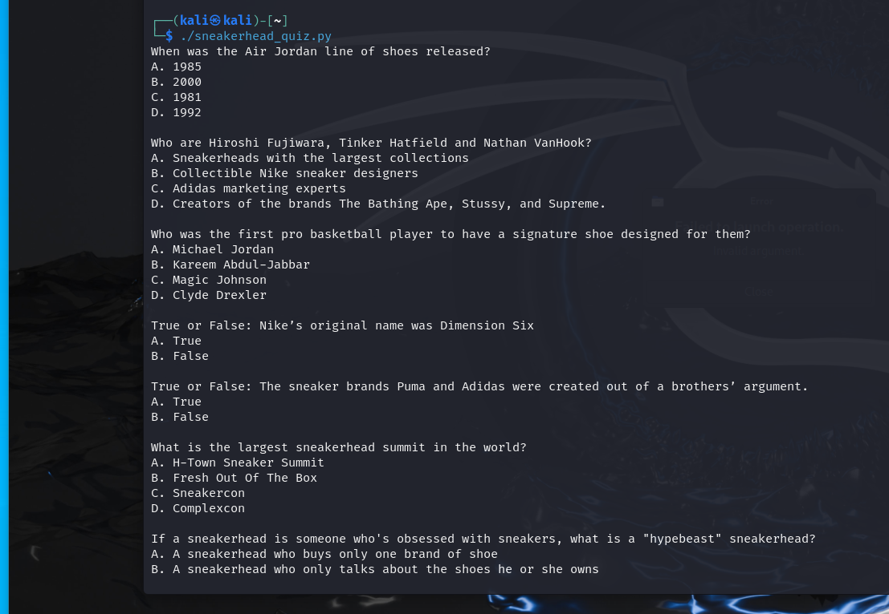
    <br />
  - Now we have to ask the user for the answer. Back in the text editor inside our defined run_quiz(questions) function, define a variable called answer and set it equal to input. Inside the input is the prompt or the question print to the user.<br />
    This allow for the program to run the inital loop and stop to wait for the users input before moving onto the next question object. <br />
    Append this function with .upper to 
    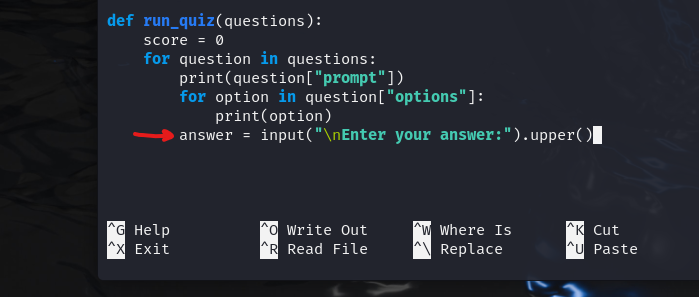
    <br />
  - Create an if and else statement comparing to what the user input was. <br />
    When setting the if statement variable equal to, as a comparison opreator, the object definition "answer" the program prints out a string notifying that the user is correct. <br />
    When correct we also want to increment the score variable. The score += 1 takes the value of what the score and increments 1 to it and sets the new variable with that plus one compared to the previous one. <br />
    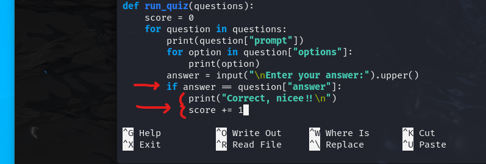
    <br />
  - The else statement is for any other input that does not match the the object definition "answer" inside the questions object.<br />
    In this example, the print function prints out a string that notifies the user that they made the wrong choice and also an explaination of the right answer in the next line. <br />
   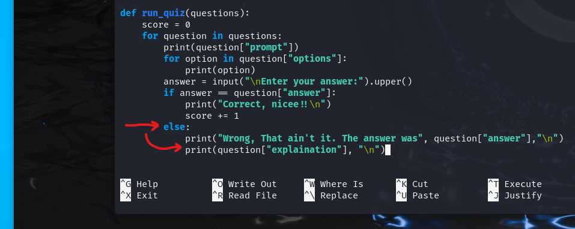
    <br />
  - These lines will run for every question inside the loop until there is no more object questions to go through.<br />
    <br />
    <br />
  
Print the quiz grade:  <br/>
  - Print the score of the ending results with the variables of score and length (number of questions) inside the curly brackets.<br />
    f : Used infront of a string allowing variable to be used. <br />
    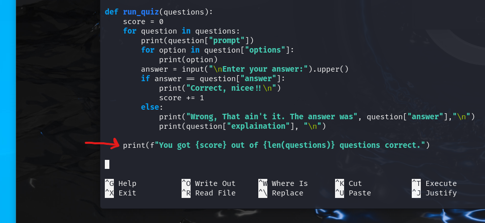
    <br />
    <br />
Run the quiz:  <br/>
  Use the run_quiz(questions) command outside and below of defined run_quiz funtion again, it not already there. Save the program and run it back in the terminal. It shoukd look like this if everything is up and running. <br />
    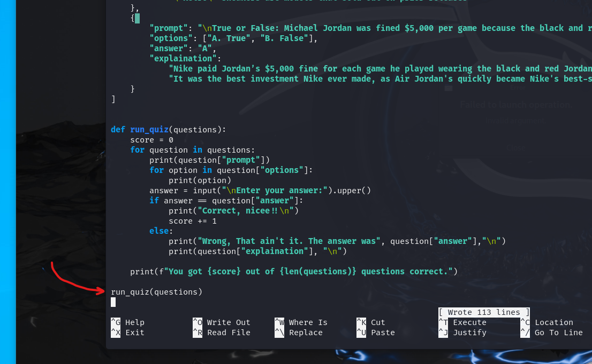
    <br />
    <br />
  There we have it! Our very own Quiz Game made of python code. Go through and take the quiz to make sure everything works.
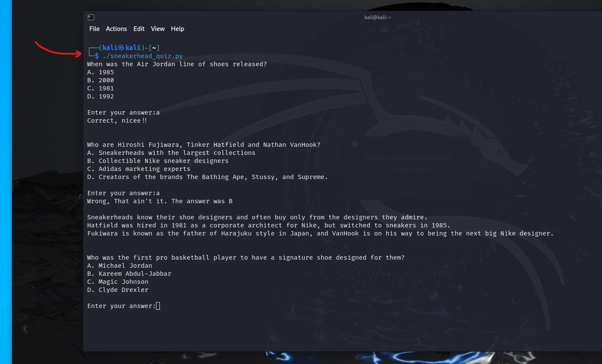

</p>


<h2>Lessons Learned</h2>

- <b>Create array of objects with definitions.</b><br />
- <b>Use for loops and the print function to show object on the terminal intended.</b><br />
- <b>Input function stoping the program from continuing the for loop waiting for user input.</b><br />
- <b>If and Else Statements to compare user input to right and wrong answers returning feedback to the user after each question.</b><br />


<!--
 ```diff
- text in red
+ text in green
! text in orange
# text in gray
@@ text in purple (and bold)@@
```
--!>
